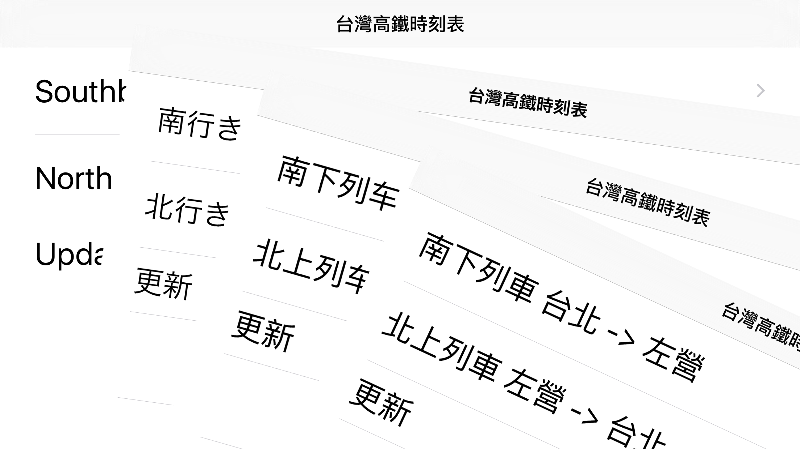

# wTHSR
---

## 起源
台灣高鐵時刻表是第一個上線的程式，當初開發的目的是因為要完成 AppStore 所有的上架流程，高鐵時刻表只有一個表格相對簡單，拿來練功的一個產品。

當初上線的中文程式非常少，自己上線後還沒有找到它的蹤跡，卻已經在討論區中已經有相關文章！令我非常意外～

上線到現在已經七年之久，安裝數量平均很穩定，在剛開始接觸 Apple 和開源軟體，心中一直有個疑問，為什麼會有這麼多人願意開放自己所開放的原始程式碼，在自己的心中問了無數次，最後找到答案。

開放原始碼的開發者，他們的技術能力都是業界的佼佼者，他們不怕別人抄襲，不怕自己的成果被別人使用，他們透過開源學習別人的技巧，並且增進自己的技能，是一個互相互補的產業結構，這個只是其中之一的原因。

## 開源 Open source
開源的想法大概兩年前就有這個想法，遲遲沒有開源的主要原因是，這個專案能分配到的時間不多，除非需要更新才會花點時間精神稍做修改，剛好高鐵新增三站，時刻表與程式需要小改，花了點時間將程式修改與開源準備一起完成，才會有這次的開源。


## 必備工具
- 	XCode 7.0 開發工具
-	git 軟體版本管理
- 	pod 開源軟體管理
-	ssdb
-	iOS 6.0 for iPhone, iPad

## Build

```
git clone https://github.com/madebyweng/wTHSR.git
```

```
cd wTHSR
pod install
```

```
用 xcode 開啟 wTHSR.xcworkspace
```



## 程式說明
```
wTHSR
-db
-libs
-Podfile
-Pods
-wTHSR
-wTHSR.xcodeproj
-wTHSR.xcworkspace
```

* db	目錄：高鐵時刻表+車站資料 (data.json), 線上更新範本(update.json)
* libs	目錄：第三方資料庫
* Podfile	檔案：pod 第三方資料庫控制檔案
* Pods	目錄：由 pod install 後產生資料
* wTHSR 目錄：高鐵時刻表主要程式
* wTHSR.xcodeproj ：xcode 專案檔案
* wTHSR.xcworkspace ：由 pod install 後產生 xcode workspace 專案檔案


本專案使用 objective-c 開發，所有的 view 由程式產生，並且支援簡單的線上更新。為了使初學者更容易學習與練習，已經將廣告相關的原始碼全部移除。

## Todo
- 加入多國語言控制,預計使用[Hodor](https://github.com/Aufree/Hodor.git)


## AppStore
[Download](https://itunes.apple.com/tw/app/wthsr-tai-wan-gao-tie-shi/id302087009?mt=8)

## 作者 Author
Harry Weng


## Taiwan 相關開源專案
#### 軟體

- [萌典網站](https://github.com/audreyt/moedict-webkit)
- [零時政府](https://github.com/g0v)

#### Maker 創客

- [Webduinoio](https://github.com/webduinoio)


## 版權 License
[GPL3](https://zh.wikipedia.org/wiki/GNU%E9%80%9A%E7%94%A8%E5%85%AC%E5%85%B1%E8%AE%B8%E5%8F%AF%E8%AF%81)
